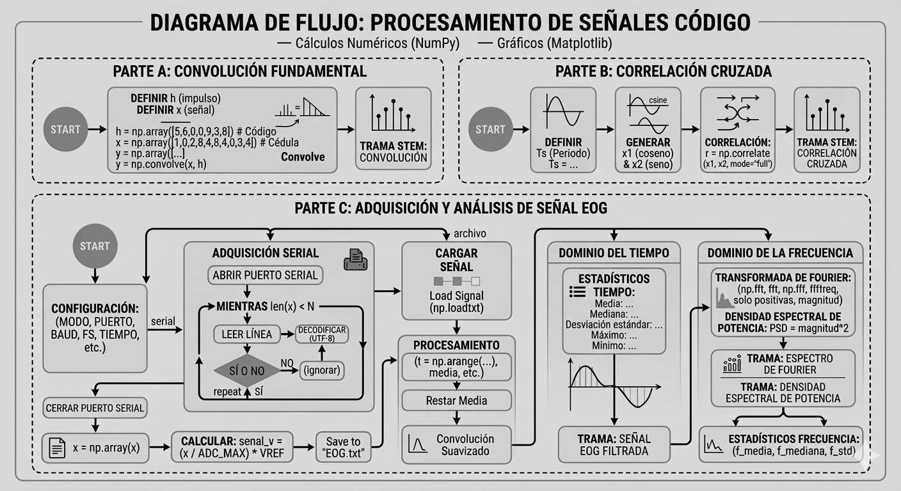
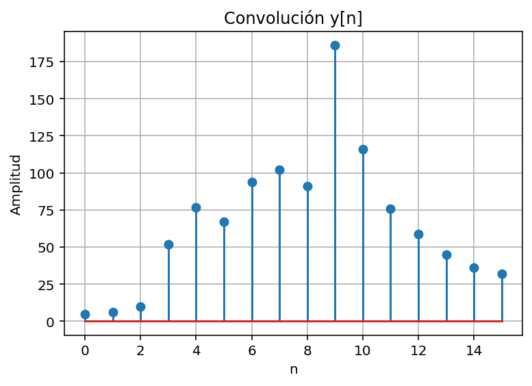
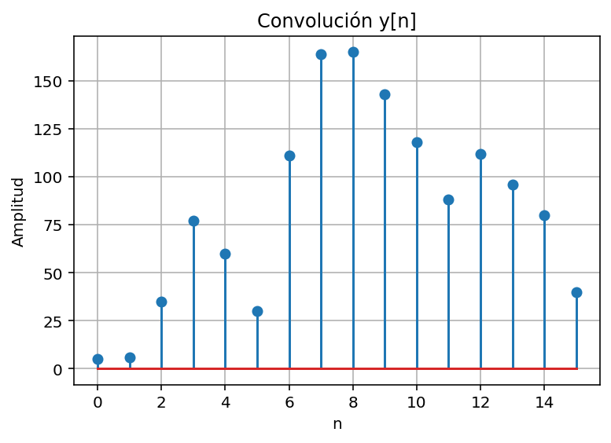
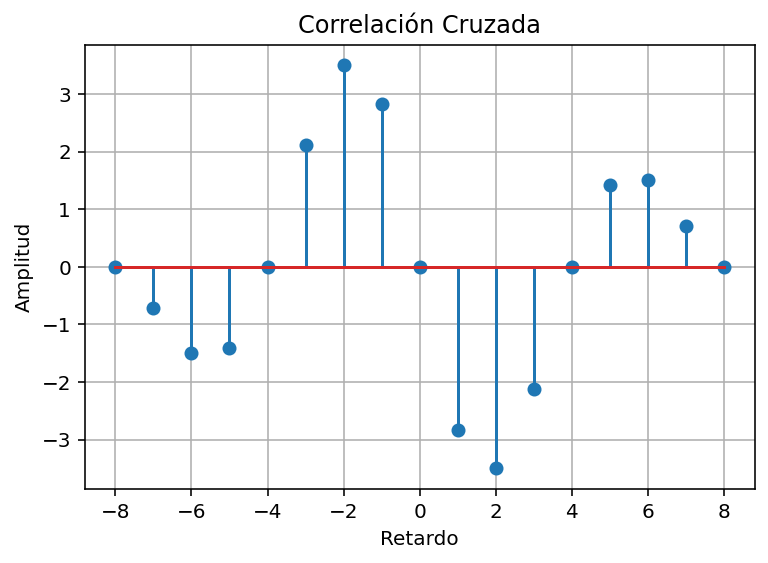
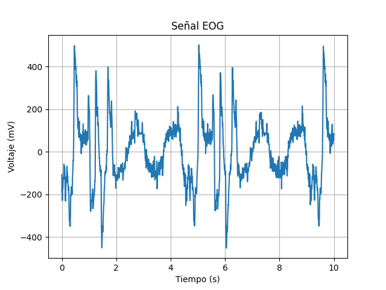
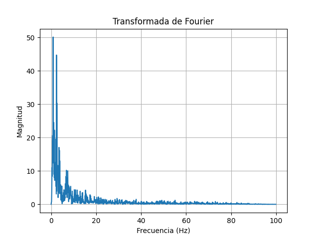
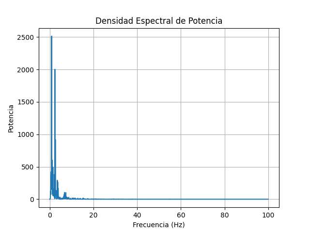
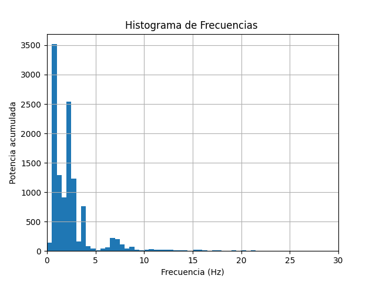

# Laboratorio 2  
## Convolución, correlación y transformada de Fourier

**Programa:** Ingeniería Biomédica  
**Asignatura:** Procesamiento Digital de Señales  
**Universidad:** Universidad Militar Nueva Granada  
**Estudiantes:** Danna Rivera, Duvan Paez

---


# Introducción
En el procesamiento digital de señales, herramientas matemáticas como la convolución, la correlación y la Transformada de Fourier permiten analizar, caracterizar y comparar señales discretas.

- La convolución describe la respuesta de un sistema ante una señal de entrada.

- La correlación cruzada mide el grado de similitud entre dos señales.

- La Transformada de Fourier permite analizar una señal en el dominio de la frecuencia, identificando sus componentes espectrales.

Estas técnicas son ampliamente utilizadas en el análisis de señales biomédicas, procesamiento de audio, imágenes y sistemas de comunicación.

## Parte A – Convolución de Señales Discretas
**Definición de señales**

Se definieron dos secuencias discretas basadas en datos personales:

*Estudiante 1:*

- Sistema:
`h[n] = {5,6,0,0,9,3,8}`

- Señal de entrada:
`x[n]={1,0,2,8,4,8,4,0,3,4}`


*Estudiante 2:*

- Sistema:
`h[n] = {5,6,0,0,8,8,8}`

- Señal de entrada:
`x[n]={1,0,7,7,2,2,7,2,5,5}`

La convolución entre ambas señales se define como:
`y[n]=x[n]∗h[n]`

**Implementación en Python:**

Se utilizó la función `numpy.convolve()` para calcular la convolución de manera automática.

El código realiza:

1. Definición de las secuencias discretas.

2. Cálculo de la convolución.

3. Visualización gráfica del resultado.

```python
y = np.convolve(x, h)
```
**Resultado:**
El resultado de la convolución corresponde a una nueva secuencia cuya longitud es:

`Ny​ = Nx​+Nh​−1`

Esta señal representa la respuesta del sistema `h[n]` cuando se aplica la señal `x[n]` como entrada.
Las gráficas generada mediante `matplotlib` permite visualizar la amplitud de cada muestra de la señal resultante.


*Estudiante 1:*



*Estudiante 2:*



---
## Parte B – Correlación Cruzada
**Definición de señales**

Se definieron dos señales sinusoidales discretas:

`x₁[nTₛ] = cos(2π · 100 · nTₛ)`

`x₂[nTₛ] = sin(2π · 100 · nTₛ)`

donde: 
`Tₛ=1.25ms`
y:
`0≤n<9`


**Implementación en Python**

La correlación cruzada se calculó utilizando:

```python
r = np.correlate(x1, x2, mode='full')
```

El parámetro `mode='full'` permite obtener todos los retardos posibles entre ambas señales.
También se calculó el vector de retardos:

```python
lags = np.arange(-len(x1)+1, len(x1))
```
**Interpretación**

La correlación cruzada permite medir el grado de similitud entre dos señales dependiendo de su desfase temporal. En este caso, las señales seno y coseno tienen un desfase de 90°, por lo tanto, la correlación presenta valores característicos que reflejan ese desplazamiento entre ambas señales.

Esta técnica se utiliza en:

detección de patrones, sincronización de señales, análisis de señales biomédicas, procesamiento de imágenes

**Resultados**



**¿En qué situaciones resulta útil aplicar la correlación cruzada en el procesamiento digital de señales?**


En el procesamiento digital de señales, la correlación cruzada resulta útil cuando se desea medir el grado de similitud entre dos señales y determinar el desfase temporal entre ellas. Esta herramienta permite identificar si dos señales tienen patrones similares y en qué momento una señal coincide con la otra.

En aplicaciones prácticas, la correlación cruzada se utiliza en detección de patrones, sincronización de señales, localización de eventos en señales biomédicas, y procesamiento de audio o comunicaciones. Por ejemplo, en señales biomédicas como EEG o EOG, permite comparar señales registradas en distintos momentos o sensores para identificar actividad similar o retrasos entre ellas. También es útil para detectar la presencia de una señal conocida dentro de otra señal con ruido, facilitando el análisis y la interpretación de datos.

---
## Parte C – Análisis de Señal Biológica

En esta sección se analizó una señal biológica obtenida mediante un generador de señales, La señal fue digitalizada utilizando un microcontrolador con convertidor analógico–digital (ADC) y posteriormente procesada en Python para analizar su comportamiento en el dominio del tiempo y de la frecuencia.

## Adquisición de la señal

El programa permite adquirir la señal de dos maneras:

- Lectura desde el puerto serial (microcontrolador).
- Carga desde archivo de texto previamente guardado.

El siguiente código define los parámetros del sistema de adquisición.

```python
# MODO puede ser:
# "serial"  -> Captura desde microcontrolador
# "archivo" -> Carga datos desde archivo
MODO = "archivo"
PORT = 'COM4'
FS = 200          # Frecuencia de muestreo (Hz)
TIEMPO = 10       # Duración de captura (s)
N = FS * TIEMPO   # Número de muestras
```
En este bloque se deifne:

- Frecuencia de muestreo
- Tiempo de adquisición
- Puerto serial

## Lectura de la señal

Si el modo seleccionado es serial, el sistema lee los datos provenientes del microcontrolador, con la finalidad de convertir los valores en voltaje y guardar los datos en un archivo de texto para su análisis posterior.

Mientras que si el modo seleccionado es archivo, se abrira una señal guardada en formato de texto e indicada en la siguiente línea de código:

```python
ARCHIVO = "EOG.txt" # Archivo donde se guarda o carga la señal
```

## Filtro de la señal

Se aplica un filtro simple utilizando convolución:

```python
h = np.array([0.5,0.5])
senal_filtrada = np.convolve(senal_centrada,h,mode='same')
```
Este filtro permite suavizar la señal del ruido producido en su captura.

## Señal en el dominio del tiempo

La señal filtrada se muestra a continuación: 



## Clasificación de la señal

### Según su naturaleza

La señal se clasifica como aleatoria, ya que proviene de procesos fisiológicos asociados al movimiento ocular. Estos procesos dependen del comportamiento de la persona y no siguen un patrón completamente predecible.

### Según su periodicidad 

Se considera aperiódica, debido a que los movimientos oculares no presentan un patrón repetitivo constante en el tiempo.

### Según su tipo

Aunque la señal original es analógica, después de ser adquirida por el microcontrolador y convertida mediante el ADC, se transforma en una señal digital que puede ser procesada mediante algoritmos computacionales.

## Estadísticos en el dominio del tiempo

Para caracterizar la señal se obtuvieron los siguientes parámetros estadísticos:

- Media: -0.01949 mV
- Mediana: -5.8445 mV
- Desviación estándar: 154.436 mV
- Máximo: 502.2507 mV
- Mínimo: -451.0826 mV

Estos valores indican que la señal presenta variaciones amplias en amplitud, lo cual es común en señales electrooculográficas debido al movimiento ocular.

## Transformada de Fpurier

Para analizar el contenido frecuencial de la señal se aplicó la representación en python de la **Transformada Discreta de Fourier:**

```python
X = np.fft.fft(senal_filtrada)/N
frecuencias = np.fft.fftfreq(N,1/FS)
pos = frecuencias >= 0
frecuencias = frecuencias[pos]
X = X[pos]
magnitud = np.abs(X)
```
Obteniendo la siguiente gráfica:



## Densidad espectral de potencia

La densidad espectral de potencia (PSD) permite observar cómo se distribuye la energía de la señal en función de la frecuencia.

```python
PSD = np.abs(X)**2
```


## Histograma de frecuencias

Se construyó un histograma ponderado por potencia para observar la distribución de energía en el espectro.



## Estadísticos en el dominio de la frecuencia

Se calcularon siguientes parámetros estadísticos del espectro:

```python
f_media = np.sum(frecuencias*PSD)/np.sum(PSD)
cumsum = np.cumsum(PSD)
f_mediana = frecuencias[np.where(cumsum>=cumsum[-1]/2)[0][0]]
f_std = np.sqrt(np.sum(((frecuencias-f_media)**2)*PSD)/np.sum(PSD))
```
Los resultados obtenidos fueron:

- Frecuencia media: 2.94 Hz
- Frecuencia mediana: 2.0 Hz
- Desviación estándar: 5.21 Hz

---

## Discusión

### ¿Qué utilidad tienen la convolución y la correlación en el procesamiento de imágenes?

La convolución se utiliza para aplicar filtros que permiten mejorar la calidad de las imágenes, eliminar ruido o detectar bordes. La correlación se utiliza para identificar patrones u objetos dentro de una imagen mediante la comparación con una referencia.

### ¿Cuándo es más útil la Transformada de Fourier que el análisis temporal?

La Transformada de Fourier es más útil cuando se desea identificar las frecuencias presentes en una señal, lo cual es importante en señales biomédicas, audio o comunicaciones donde el contenido frecuencial es relevante.

### ¿En qué se diferencia la correlación de la convolución?

La principal diferencia es que en la convolución una señal se invierte antes de realizar la operación, mientras que en la correlación se comparan directamente las señales para medir su similitud.

---

## Análisis de resultados

### Convolución y correlación

La convolución permite analizar cómo un sistema responde a una señal de entrada y se utiliza comúnmente para implementar filtros digitales. Por su parte, la correlación permite medir la similitud entre dos señales y detectar posibles desfases temporales entre ellas.

Sin embargo, ambas técnicas pueden verse afectadas por el ruido presente en las señales y el esfuerzo computacional puede aumentar cuando se trabaja con señales de gran tamaño.

### Transformada de Fourier

La Transformada de Fourier permite analizar una señal en el dominio de la frecuencia e identificar las componentes frecuenciales presentes. En el caso de la señal EOG analizada, se observa que la mayor parte de la energía se concentra en frecuencias bajas. No obstante, esta herramienta no muestra cómo cambian las frecuencias en el tiempo, lo que puede limitar su uso en aplicaciones más avanzadas.

---

## Conclusiones 

En este laboratorio se aplicaron herramientas fundamentales del procesamiento digital de señales como la convolución, la correlación y la Transformada de Fourier.

La convolución permitió analizar la respuesta de un sistema discreto ante una señal de entrada, mientras que la correlación cruzada permitió evaluar la similitud entre señales con diferentes desfases.

Finalmente, el análisis de una señal biológica mediante la Transformada de Fourier permitió observar que su contenido energético se concentra principalmente en bajas frecuencias, lo cual es característico de señales EOG.

Esto indica que la mayor parte de la energía de la señal se concentra en frecuencias bajas, característica típica de señales EOG.
